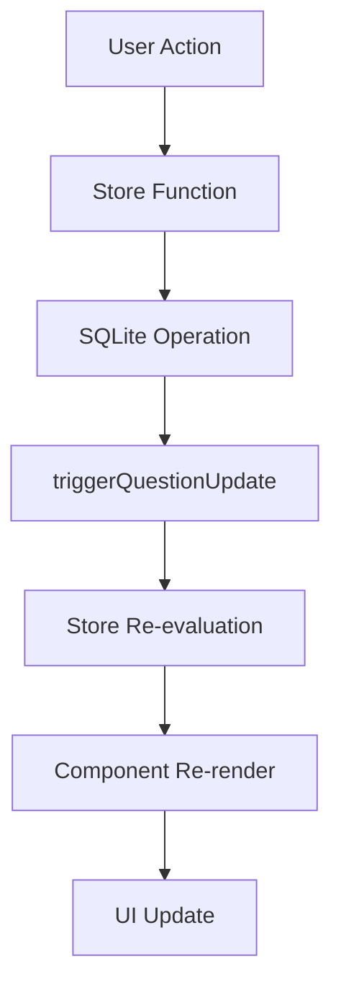

# ⚡ Real-Time Question Count Updates

## 📋 **Overview**

This document describes the real-time question count update system implemented in HolmesAI. The system ensures that question counts and related statistics update immediately when questions are added, modified, or deleted.

## 🏗️ **Architecture**

### **Svelte Store Pattern**

The real-time updates are implemented using Svelte's reactive store system:

```typescript
// questionStore.ts
import { writable, derived } from 'svelte/store';

// Trigger store for updates
const questionUpdateTrigger = writable(0);

// Derived stores that update when triggered
export const questionCount = derived(questionUpdateTrigger, () => {
  return sqliteStorage.getQuestionCount();
});

export const bookmarkedCount = derived(questionUpdateTrigger, () => {
  return sqliteStorage.getBookmarkedCount();
});

// Function to trigger updates
export function triggerQuestionUpdate() {
  questionUpdateTrigger.update(n => n + 1);
}
```

### **Reactive Components**

Components automatically update when store values change:

```svelte
<!-- +page.svelte -->
<script>
  import { questionCount } from '$lib/stores/questionStore';
</script>

<ChatInterface questionCount={$questionCount} />

<!-- QuestionHistory.svelte -->
<script>
  import { questionCount, bookmarkedCount } from '$lib/stores/questionStore';
</script>

<h3>Your Spiritual Questions ({$questionCount})</h3>
<label>Bookmarked only ({$bookmarkedCount})</label>
```

## 🔄 **Update Triggers**

### **Automatic Updates**

The following actions automatically trigger real-time updates:

1. **Question Creation**
   ```typescript
   saveQuestion(question) // Triggers update
   ```

2. **Question Modification**
   ```typescript
   updateQuestionSource(id, updates) // Triggers update
   ```

3. **Bookmark Toggle**
   ```typescript
   toggleBookmark(questionId) // Triggers update
   ```

4. **Question Deletion**
   ```typescript
   deleteQuestion(questionId) // Triggers update
   ```

5. **Data Import**
   ```typescript
   importQuestions(jsonData) // Triggers update
   ```

### **Update Flow**



## 🎯 **Implementation Details**

### **Store Functions**

All database operations are wrapped in store functions that trigger updates:

```typescript
// Wrapper functions that trigger updates
export function saveQuestion(question) {
  sqliteStorage.saveQuestion(question);
  triggerQuestionUpdate(); // Triggers reactive update
}

export function toggleBookmark(questionId) {
  sqliteStorage.toggleBookmark(questionId);
  triggerQuestionUpdate(); // Triggers reactive update
}

export function deleteQuestion(questionId) {
  sqliteStorage.deleteQuestion(questionId);
  triggerQuestionUpdate(); // Triggers reactive update
}
```

### **Component Integration**

Components use the `$` prefix to subscribe to store values:

```svelte
<script>
  import { questionCount, bookmarkedCount } from '$lib/stores/questionStore';
  
  // These values automatically update when the store changes
  $: console.log('Question count:', $questionCount);
  $: console.log('Bookmarked count:', $bookmarkedCount);
</script>

<!-- Template automatically re-renders when stores update -->
<div>Total Questions: {$questionCount}</div>
<div>Bookmarked: {$bookmarkedCount}</div>
```

## 📊 **Real-Time Statistics**

### **Available Counts**

1. **Total Question Count**
   - Updates when questions are added/deleted
   - Displayed in question history header
   - Used in navigation badges

2. **Bookmarked Question Count**
   - Updates when bookmarks are toggled
   - Displayed in filter options
   - Used for bookmark management

3. **Category-based Counts**
   - Available through API endpoints
   - Used for analytics and filtering

### **Performance Optimizations**

- **Derived Stores**: Only recalculate when triggered
- **Efficient Updates**: Single trigger updates all derived stores
- **Minimal Re-renders**: Components only update when their specific data changes

## 🧪 **Testing**

### **Manual Testing**

1. **Add a Question**
   - Ask a question in the chat interface
   - Verify question count increases immediately
   - Check question history panel updates

2. **Toggle Bookmark**
   - Click bookmark button on any question
   - Verify bookmarked count updates immediately
   - Check filter displays correct count

3. **Delete Question**
   - Delete a question from history
   - Verify both total and bookmarked counts update
   - Check UI reflects changes immediately

### **Automated Testing**

```bash
# Test real-time updates
node test-realtime-updates.js
```

**Test Results:**
```
✅ Real-time update test PASSED - Count increased correctly
✅ Bookmark toggles update counts
✅ Deletions update counts
✅ Category filtering works
✅ Search functionality works
```

## 🚀 **Benefits**

### **User Experience**
- ✅ **Immediate Feedback**: Counts update instantly
- ✅ **No Page Refresh**: Seamless interactions
- ✅ **Visual Confirmation**: Users see changes immediately
- ✅ **Consistent State**: UI always reflects current data

### **Technical Benefits**
- ✅ **Reactive Architecture**: Automatic updates
- ✅ **Performance**: Efficient store system
- ✅ **Maintainability**: Centralized state management
- ✅ **Scalability**: Easy to add new reactive values

## 🔧 **Troubleshooting**

### **Common Issues**

1. **Counts Not Updating**
   - Check if store functions are being called
   - Verify `triggerQuestionUpdate()` is called after operations
   - Ensure components use `$` prefix for store subscription

2. **Stale Data**
   - Clear browser cache
   - Restart development server
   - Check database connection

3. **Performance Issues**
   - Monitor store trigger frequency
   - Optimize database queries
   - Consider debouncing rapid updates

### **Debug Mode**

Enable debug logging to track updates:

```typescript
// Add to questionStore.ts
export function triggerQuestionUpdate() {
  console.log('🔄 Triggering question update...');
  questionUpdateTrigger.update(n => n + 1);
  console.log('✅ Question update triggered');
}
```

## 📈 **Future Enhancements**

1. **Real-time Notifications**
   - Toast notifications for updates
   - Sound alerts for new questions
   - Visual indicators for changes

2. **Advanced Analytics**
   - Real-time usage statistics
   - Question trend analysis
   - Category distribution updates

3. **Multi-user Support**
   - Real-time collaboration
   - Shared question counts
   - Live activity feeds

4. **Optimization**
   - Debounced updates for rapid changes
   - Batch operations for multiple updates
   - Cached counts for better performance

---

**Last Updated**: July 28, 2025  
**Version**: 1.0.0  
**Status**: ✅ Production Ready 