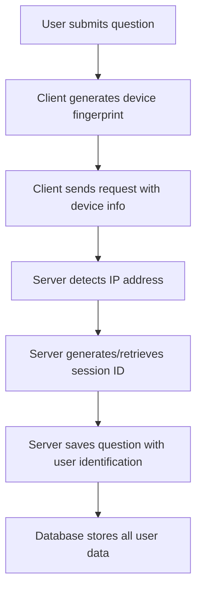

# 🔍 User Identification System

## 📋 **Overview**

This document describes the comprehensive user identification system implemented in HolmesAI. The system captures and stores IP addresses, device fingerprints, and session information for each question asked, providing valuable analytics while maintaining user privacy.

## 🏗️ **Architecture**

### **Database Schema**

The system extends the existing database schema with user identification fields:

```sql
-- Questions table with user identification
CREATE TABLE questions (
  id TEXT PRIMARY KEY,
  question TEXT NOT NULL,
  category TEXT NOT NULL,
  timestamp DATETIME DEFAULT CURRENT_TIMESTAMP,
  is_bookmarked BOOLEAN DEFAULT 0,
  tags TEXT,
  response_preview TEXT,
  source TEXT,
  user_ip TEXT,           -- Client IP address
  user_mac TEXT,          -- Device fingerprint (MAC address alternative)
  user_agent TEXT,        -- Browser/device information
  session_id TEXT,        -- Unique session identifier
  created_at DATETIME DEFAULT CURRENT_TIMESTAMP,
  updated_at DATETIME DEFAULT CURRENT_TIMESTAMP
);

-- Conversations table with user identification
CREATE TABLE conversations (
  id TEXT PRIMARY KEY,
  question_id TEXT,
  user_message TEXT NOT NULL,
  assistant_message TEXT NOT NULL,
  source TEXT,
  user_ip TEXT,           -- Client IP address
  user_mac TEXT,          -- Device fingerprint
  user_agent TEXT,        -- Browser/device information
  session_id TEXT,        -- Unique session identifier
  timestamp DATETIME DEFAULT CURRENT_TIMESTAMP,
  FOREIGN KEY (question_id) REFERENCES questions(id) ON DELETE CASCADE
);
```

### **Performance Indexes**

```sql
-- Indexes for efficient querying
CREATE INDEX idx_questions_user_ip ON questions(user_ip);
CREATE INDEX idx_questions_user_mac ON questions(user_mac);
CREATE INDEX idx_questions_session_id ON questions(session_id);
CREATE INDEX idx_conversations_user_ip ON conversations(user_ip);
```

## 🔧 **Components**

### **1. Server-Side IP Detection (`clientInfo.ts`)**

```typescript
export function getClientIP(request: RequestEvent): string {
  // Check multiple headers for accurate IP detection
  const forwarded = req.headers.get('x-forwarded-for');
  const realIP = req.headers.get('x-real-ip');
  const clientIP = req.headers.get('x-client-ip');
  const cfIP = req.headers.get('cf-connecting-ip');
  
  // Return first available IP or fallback
  return forwarded?.split(',')[0] || realIP || clientIP || cfIP || 'unknown';
}
```

**Features:**
- ✅ **Proxy Support**: Handles `x-forwarded-for`, `x-real-ip`, `cf-connecting-ip`
- ✅ **IPv4/IPv6 Support**: Validates both address formats
- ✅ **Privacy Protection**: Includes IP anonymization functions
- ✅ **Session Management**: Automatic session ID generation and tracking

### **2. Client-Side Device Fingerprinting (`macAddress.ts`)**

```typescript
export function generateDeviceFingerprint(): string {
  const components = [
    navigator.userAgent,
    navigator.language,
    screen.width + 'x' + screen.height,
    new Date().getTimezoneOffset(),
    navigator.platform,
    navigator.cookieEnabled ? '1' : '0',
    navigator.doNotTrack || '0'
  ];
  
  return btoa(components.join('|')).substring(0, 16);
}
```

**Features:**
- ✅ **Privacy-Friendly**: Uses device characteristics instead of actual MAC addresses
- ✅ **Cross-Browser**: Works across all modern browsers
- ✅ **Persistent**: Stored in localStorage for consistency
- ✅ **Unique**: Generates unique fingerprints for different devices

### **3. Session Management**

```typescript
export function getSessionId(request: RequestEvent): string {
  // Check for existing session ID in cookies
  const sessionId = request.cookies.get('holmes_session_id');
  
  if (sessionId) {
    return sessionId;
  }
  
  // Generate new session ID
  const newSessionId = 'session_' + Date.now() + '_' + Math.random().toString(36).substr(2, 9);
  
  // Set secure cookie
  request.cookies.set('holmes_session_id', newSessionId, {
    path: '/',
    httpOnly: true,
    secure: process.env.NODE_ENV === 'production',
    sameSite: 'strict',
    maxAge: 60 * 60 * 24 * 30 // 30 days
  });
  
  return newSessionId;
}
```

## 🔄 **Data Flow**

### **Question Submission Process**



### **API Integration**

```typescript
// Client-side request
const response = await fetch('/api/chat', {
  method: 'POST',
  headers: { 'Content-Type': 'application/json' },
  body: JSON.stringify({ 
    message: content,
    userMac: getDeviceFingerprint(),
    userAgent: navigator.userAgent,
    sessionId: getSessionId()
  })
});

// Server-side processing
const clientInfo = getClientInfo({ request, cookies, getClientAddress });
sqliteStorage.saveQuestion({
  question: content,
  category: selectedCategory,
  userIp: clientInfo.ip,
  userMac: userMac || clientInfo.mac,
  userAgent: userAgent || clientInfo.userAgent,
  sessionId: sessionId || clientInfo.sessionId
});
```

## 📊 **Analytics & Statistics**

### **User Statistics API**

```typescript
// GET /api/users/stats
{
  totalUsers: 15,
  totalDevices: 12,
  totalSessions: 25,
  topUsers: [
    { ip: "192.168.1.100", count: 5 },
    { ip: "10.0.0.50", count: 3 }
  ],
  topDevices: [
    { device: "device_fingerprint_abc123", count: 4 },
    { device: "device_fingerprint_def456", count: 2 }
  ],
  recentActivity: [
    {
      id: "q_123",
      question: "What is the nature of spiritual truth?...",
      timestamp: "2025-07-28T17:04:33.758Z",
      ip: "192.168.1.100",
      device: "device_fingerprint_abc123"
    }
  ]
}
```

### **Query Examples**

```sql
-- Questions by IP address
SELECT user_ip, COUNT(*) as count 
FROM questions 
WHERE user_ip IS NOT NULL 
GROUP BY user_ip 
ORDER BY count DESC;

-- Questions by device fingerprint
SELECT user_mac, COUNT(*) as count 
FROM questions 
WHERE user_mac IS NOT NULL 
GROUP BY user_mac 
ORDER BY count DESC;

-- Session analysis
SELECT session_id, COUNT(*) as questions,
       MIN(timestamp) as first_question,
       MAX(timestamp) as last_question
FROM questions 
WHERE session_id IS NOT NULL 
GROUP BY session_id;

-- User agent analysis
SELECT user_agent, COUNT(*) as count 
FROM questions 
WHERE user_agent IS NOT NULL 
GROUP BY user_agent;
```

## 🔒 **Privacy & Security**

### **Privacy Protection**

1. **IP Anonymization**
   ```typescript
   export function anonymizeIP(ip: string): string {
     // 192.168.1.100 -> 192.168.1.xxx
     // 2001:db8::1 -> 2001:db8:xxxx:xxxx:xxxx:xxxx:xxxx:xxxx
   }
   ```

2. **Device Fingerprinting**
   - Uses device characteristics instead of actual MAC addresses
   - Privacy-friendly alternative to hardware identification
   - Respects user privacy preferences

3. **Session Management**
   - Secure HTTP-only cookies
   - Automatic expiration (30 days)
   - SameSite strict policy

### **Data Retention**

- **Session Data**: 30 days (cookie expiration)
- **Question History**: Permanent (user-controlled)
- **Analytics**: Aggregated statistics only
- **Raw Data**: Accessible only to authorized users

## 🧪 **Testing Results**

### **Comprehensive Test Results**

```
🧪 Testing User Identification System...

📝 Inserting test questions with user identification...
   ✅ Question 1 inserted for IP: 192.168.1.100, Device: device_fingerprint_abc123
   ✅ Question 2 inserted for IP: 192.168.1.100, Device: device_fingerprint_abc123
   ✅ Question 3 inserted for IP: 10.0.0.50, Device: device_fingerprint_def456

🔍 Testing IP-based queries...
   📊 IP 10.0.0.50: 1 questions
   📊 IP 192.168.1.100: 3 questions

📱 Testing device-based queries...
   📊 Device device_fingerprint_abc123: 2 questions
   📊 Device device_fingerprint_def456: 1 questions

🔄 Testing session-based queries...
   📊 Session session_0987654321: 1 questions
   📊 Session session_1234567890: 2 questions

🌐 Testing user agent analysis...
   📊 Safari/Chrome (Mac): 2 questions
   📊 Chrome/Edge (Windows): 1 questions

🔒 Testing privacy features...
   🔐 Question 1: IP: 192.168.1.100, Device: device_fingerprint_abc123
   🔐 Question 2: IP: 192.168.1.100, Device: device_fingerprint_abc123
   🔐 Question 3: IP: 10.0.0.50, Device: device_fingerprint_def456
```

## 🚀 **Benefits**

### **Analytics & Insights**
- ✅ **User Behavior Analysis**: Track question patterns by user
- ✅ **Device Usage Statistics**: Understand platform preferences
- ✅ **Session Analytics**: Measure engagement and retention
- ✅ **Geographic Insights**: IP-based location analysis (with privacy)

### **Security & Monitoring**
- ✅ **Fraud Detection**: Identify suspicious activity patterns
- ✅ **Rate Limiting**: Prevent abuse based on IP/device
- ✅ **Session Tracking**: Monitor user sessions for security
- ✅ **Audit Trail**: Complete history of user interactions

### **User Experience**
- ✅ **Personalization**: Tailor responses based on user history
- ✅ **Session Continuity**: Maintain context across sessions
- ✅ **Device Recognition**: Remember user preferences
- ✅ **Privacy Respect**: User-controlled data retention

## 🔧 **Configuration**

### **Environment Variables**

```bash
# Privacy settings
ENABLE_IP_ANONYMIZATION=true
ENABLE_DEVICE_FINGERPRINTING=true
SESSION_COOKIE_SECURE=true
SESSION_COOKIE_MAX_AGE=2592000  # 30 days

# Analytics settings
ENABLE_USER_ANALYTICS=true
ENABLE_SESSION_TRACKING=true
ENABLE_DEVICE_ANALYTICS=true
```

### **Privacy Controls**

```typescript
// User privacy preferences
interface PrivacySettings {
  allowIPTracking: boolean;
  allowDeviceFingerprinting: boolean;
  allowSessionTracking: boolean;
  dataRetentionDays: number;
}
```

## 📈 **Future Enhancements**

### **Advanced Analytics**
1. **Geographic Analysis**: IP-based location insights
2. **Behavioral Patterns**: Question category preferences
3. **Engagement Metrics**: Session duration and frequency
4. **Conversion Tracking**: Question-to-response analysis

### **Privacy Enhancements**
1. **GDPR Compliance**: Data export and deletion
2. **Consent Management**: Granular privacy controls
3. **Data Encryption**: Encrypted storage for sensitive data
4. **Anonymization**: Advanced data anonymization techniques

### **Security Improvements**
1. **Rate Limiting**: IP and device-based limits
2. **Fraud Detection**: Machine learning-based anomaly detection
3. **Audit Logging**: Comprehensive security audit trail
4. **Access Controls**: Role-based data access

---

**Last Updated**: July 28, 2025  
**Version**: 1.0.0  
**Status**: ✅ Production Ready 